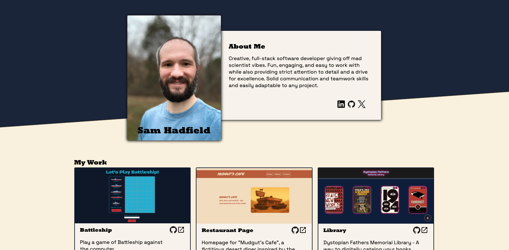
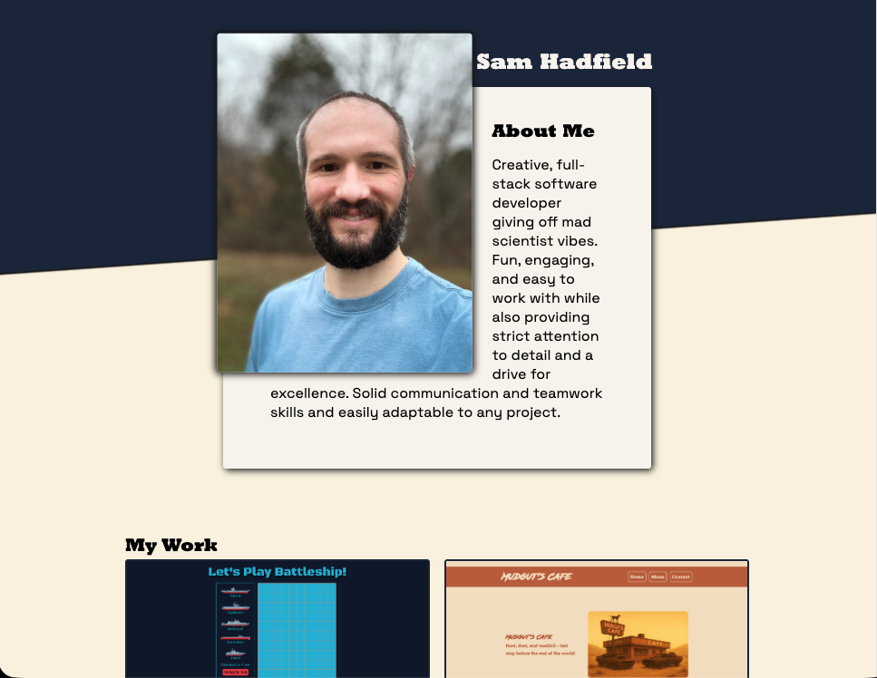

# Homepage / Portfolio

Mock homepage/portfolio project for "The Odin Project" curriculum

## 🗣️ Description:

Mock homepage to explore responsive design and accessibility with semantic HTML

## Live Preview:

[Sam's Dev Lab | Homepage](https://samsdevlab.github.io/homepage/)

## 👨‍💻 Technologies Utilized:

- HTML
- CSS

## ✨ Features:

- Fonts from Google Fonts (Rockwell Extra Bold | Space Grotesk)
- GitHub, LinkedIn, X icons from [Devicons](https://devicon.dev/)
- Phone, Email, and External Link icons from [Pictogrammers](https://pictogrammers.com/library/mdi/)
- Animated Sam's Dev Lab photo generated from ChatGPT custom prompt

## 💻 Screenshots:

### Desktop

### Tablet

### Mobile

